  

I'm Blaze. I keep systems boring on purpose: backups that actually restore, deploys nobody has to babysit, and dashboards that are green because nothing is on fire, not because nobody is looking.

## Technologies I know well

| | |
| --- | --- |
| Networking | WireGuard, NetBird mesh, Pangolin + Newt (reverse proxy and tunnels, zero published ports), Cloudflare DNS and DDNS, SMB/CIFS |
| Identity & security | OIDC, SAML, Pocket ID, Authlib, Microsoft Entra ID, JumpCloud, SentinelOne, RBAC with audit logs, MFA/TOTP, FIDO2, age encryption, Android Keystore |
| Backups & storage | restic, Backrest, S3 and Backblaze B2, ZFS on TrueNAS, nightly database dumps, config-as-code in git, written restore runbooks |
| Containers | Docker, Compose, buildx multi-arch, GHCR, Watchtower, Portainer-style stack envs, non-root images with healthchecks |
| Platforms | Proxmox VE, TrueNAS SCALE, Ubuntu Server, Windows Server, Hetzner and RackNerd VPS |
| Observability & alerting | Zabbix, Beszel, CheckCle, Uptime Kuma, `/proc` resource sampling, webhook run notifications, Gotify, ntfy, Slack and SMTP alerting |
| Automation & CI | n8n, MCP, cron, systemd, Dagu, GitHub Actions, GoReleaser, Forgejo |
| AI tooling | n8n AI agents, MCP servers and tools, OpenRouter, Open WebUI |
| Data | PostgreSQL, SQLite, Redis/Valkey, MariaDB, Alembic migrations |
| Languages | Go, Python, PowerShell 7, Kotlin, TypeScript, Bash, SQL |
| Microsoft 365 | Graph API (app-only auth), Exchange Online, Teams, SharePoint, Intune |
| Google | Workspace Admin, Vault, domain-wide delegation |
| Commerce & ERP | Shopify Admin GraphQL, Amazon SP-API, NetSuite SuiteQL |

## What I do

- **Ship containers properly** — multi-stage Dockerfiles, non-root users, `HEALTHCHECK`s, `depends_on: service_healthy`, migrations at container start, multi-arch (amd64/arm64) images on GHCR via buildx, and single static Go binaries with GoReleaser when a container is overkill.
- **Release without ceremony** — scripted pipelines that lint, test, build, push, tag, and write release notes in one command. GitHub Actions for CI (`go test -race`, golangci-lint, Pester, PSScriptAnalyzer). `curl | bash` installers that double as updaters and verify checksums. Self-hosted browser-extension distribution with MDM force-install and an `updates.xml` feed.
- **Keep the network closed** — WireGuard mesh instead of port forwards, tunnel-based ingress, DDNS, VPN-gated egress, OIDC in front of everything, RBAC with audit logs, TOTP.
- **Handle secrets like they matter** — age-encrypted vaults unlocked by Touch ID or FIDO2, keys that never touch disk, redaction in logs and webhook payloads, `.env` files at mode 600, git sync that refuses to push plaintext.
- **Make failure survivable** — restic backups to a NAS, config-as-code with diff-only commits, written restore runbooks, retry queues for outbound webhooks, per-job locks and timeouts, missed-run detection, `--dry-run` and resumable state on anything that changes the world.
- **Watch the fleet** — host and container metrics, uptime probes, GPU agents, `/proc` CPU and RSS sampling per job, run history with sparklines, and every scheduled job reporting exit code, duration, and a log tail to a webhook.
- **Glue the business together** — n8n workflows with AI agents that call MCP tools, then hand results to people over email. Microsoft Graph with app-only certificate auth, Exchange Online, Teams, SharePoint, Intune, JumpCloud, Google Workspace with domain-wide delegation, Google Vault, Shopify Admin GraphQL, Amazon SP-API, NetSuite SuiteQL over OAuth 2.0 M2M.
- **Automate the tenant** — onboarding that creates the user, MFA, groups, device binding, and licence in one run. Offboarding that takes a Vault backup and verifies it before it removes anything. Mailbox, calendar, and transcript pipelines that run unattended and page only on non-zero exit.
- **Build the tooling I wish existed** — terminal UIs in Go (Bubble Tea, Lip Gloss) and PowerShell 7, MCP and REST servers behind bearer tokens, systemd units, FastAPI apps with SQLAlchemy and Alembic, Android and Wear OS apps that talk to self-hosted automation, Chrome extensions that POST to webhooks.

## Elsewhere

GitHub is the best place to find me.
<!-- add a site, email, or LinkedIn here -->
