I'm Blaze. I keep systems boring on purpose: backups that actually restore, deploys nobody has to babysit, and dashboards that are green because nothing is on fire, not because nobody is looking.

<!-- tags:start -->
 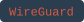 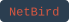 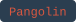 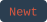   

 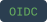   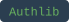 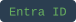   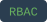   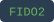 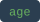 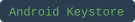

 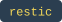     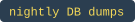  

         

  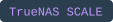    

        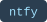  

 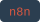  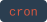 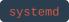  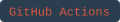  

 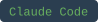 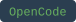  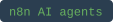  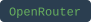 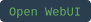

      

    

 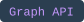   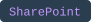 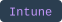  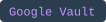

          
<!-- tags:end -->

- **Ship containers properly** — multi-stage Dockerfiles, non-root users, `HEALTHCHECK`s, `depends_on: service_healthy`, migrations at container start, multi-arch (amd64/arm64) images on GHCR via buildx. systemd units and cron for anything that isn't a container.
- **Release without ceremony** — scripted pipelines that lint, test, build, push, tag, and write release notes in one command. GitHub Actions for CI, with Pester and PSScriptAnalyzer keeping PowerShell honest.
- **Keep the network closed** — WireGuard mesh instead of port forwards, tunnel-based reverse proxy ingress, DDNS, OIDC in front of everything, RBAC with audit logs, MFA.
- **Handle secrets like they matter** — encrypted vaults, `.env` files at mode 600 and out of git, redaction in logs and webhook payloads, nothing in plaintext in a repo.
- **Make failure survivable** — restic backups to a NAS and S3, config-as-code with diff-only commits, written restore runbooks, `--dry-run` and resumable state on anything that changes the world.
- **Watch the fleet** — host and container metrics, uptime probes, and alerts that reach a person through Gotify, ntfy, Slack, or email with a log tail attached.
- **Glue the business together** — n8n workflows with AI agents that call MCP tools, backed by MCP and REST servers and FastAPI apps written in Python, then hand results to people over email.
- **Automate the tenant** — onboarding that creates the user, MFA, groups, device binding, and licence in one run. Offboarding that takes a Vault backup and verifies it before it removes anything. Mailbox, calendar, and transcript pipelines that run unattended and page only on non-zero exit.
